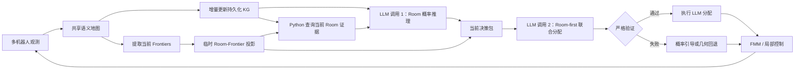

# MindNav：基于持久化知识图谱与层次化 LLM 推理的多机器人目标导航

## 1. 方法概述

MindNav 面向未知室内环境中的多机器人目标导航（Multi-Robot ObjectNav）。给定目标类别 $g$（如 *chair*、*toilet*），$K$ 个机器人需要在共享语义地图上协同探索，在有限步数内尽快发现目标并完成导航。

MindNav 的核心思想是：**将长期环境知识与当前可执行动作分离，并让大语言模型先在房间层面进行语义推理，再在选定房间内部完成 frontier 分配。** 具体而言：

1. 使用一个跨规划轮次持续更新的知识图谱（Knowledge Graph, KG），累积房间、物体和机器人状态；
2. 每轮规划时，从当前语义地图提取可执行 frontier，并构造临时的 room–frontier 投影；
3. 第一次 LLM 调用读取完整 KG，对每个当前候选房间独立估计目标存在概率；
4. 第二次 LLM 调用读取紧凑的当前决策包，执行“先选房间、再选 frontier”的多机器人联合分配；
5. 对 LLM 输出进行严格的可执行性验证，并在输出失效时使用当前 frontier 上的确定性回退策略。

MindNav 只替换系统中的**高层 frontier 决策模块**。语义感知、共享地图更新、frontier 提取、FMM/局部控制、目标检测与 STOP 判定均保持原系统不变。因此，方法性能的变化可以主要归因于 KG 表征和 LLM 高层决策，而不是底层导航组件的变化。



---

## 2. 问题定义与符号

在规划时刻 $t$，机器人集合记为

\[
\mathcal{A}=\{a_1,\ldots,a_K\},
\]

当前提取的 frontier 集合为

\[
\mathcal{F}_t=\{f_1,\ldots,f_{N_t}\}.
\]

每个 frontier $f$ 具有质心位置 $c_f\in\mathbb{R}^2$、区域面积 $s_f$，以及机器人到该 frontier 的地图距离 $d(a_k,f)$。当前候选房间集合记为 $\mathcal{R}_t$。临时映射

\[
\mu_t:\mathcal{F}_t\rightarrow\mathcal{R}_t
\]

将每个当前 frontier 映射到一个房间代理节点。一个房间可以包含多个 frontier：

\[
\mathcal{F}_t(r)=\{f\in\mathcal{F}_t\mid \mu_t(f)=r\}.
\]

系统需要为每个机器人产生一个联合分配

\[
\mathcal{A}_t^{\mathrm{nav}}=
\{(a_k,r_k,f_k)\}_{k=1}^{K},
\]

其中 $r_k\in\mathcal{R}_t$、$f_k\in\mathcal{F}_t(r_k)$。该定义显式保留“一个 room 对应多个 frontier”的一对多关系，避免将 room 选择和 frontier 选择错误地压缩为同一个决策。

### 2.1 主要符号

| 符号 | 含义 |
|---|---|
| $g$ | 当前目标物体类别 |
| $G_t=(V_t,E_t)$ | 时刻 $t$ 的持久化知识图谱 |
| $\mathcal{F}_t$ | 当前规划轮次可执行的 frontier 集合 |
| $\mathcal{R}_t$ | 当前 frontier 所对应的候选房间集合 |
| $\mu_t(f)$ | frontier $f$ 所属的当前房间 |
| $p_r^t$ | LLM 估计的目标存在于房间 $r$ 的概率 |
| $q_r^t$ | LLM 对该概率估计的置信度 |
| $e_r^t$ | 支撑概率判断的 KG 节点证据集合 |
| $H_t$ | 最近若干轮分配和探索反馈的历史摘要 |

---

## 3. 长期知识与短期动作的双层状态表示

MindNav 不把瞬时 frontier 直接写入长期 KG，而是同时维护两个互补状态：

### 3.1 持久化知识图谱

持久化图谱

\[
G_t=(V_t,E_t)
\]

在一个 episode 内跨规划轮次保留，用于表达已经观察到的环境语义、空间关系和机器人状态。它回答的是“系统到目前为止知道什么”。

### 3.2 当前 Frontier View

当前 frontier view 记为

\[
C_t=(\mathcal{F}_t,\mu_t),
\]

它只在本轮规划中有效，保存当前可执行 frontier 及其 room 映射。它回答的是“系统此刻可以执行什么”。下一次重新提取 frontier 后，$C_t$ 被整体重建。

这种解耦解决了两个关键问题：

- **身份稳定性：** 房间和物体节点可以作为跨轮次证据被引用，而 frontier 编号会随地图更新发生变化，不适合进入长期记忆；
- **动作安全性：** LLM 只能从 $C_t$ 中选择当前有效 frontier，历史 frontier 不可能被误执行。

---

## 4. 持久化知识图谱的构建与增量更新

### 4.1 节点类型

当前实现实际构建三类节点：

1. **Room 节点。** 保存房间代理位置、观测到的房间类型及其置信度、探索状态、观测次数、已观测物体类别和最近更新时间；
2. **Object 节点。** 保存物体类别、位置、检测置信度、独立观测次数及观测签名；
3. **Robot 节点。** 保存机器人当前位置和最近更新时间。

当前代码不依赖 Door 节点完成推理。墙体阻隔通过房间之间的关系边表达，而不是被建模为可分配节点。

### 4.2 坐标约定与房间代理

所有 KG 几何量统一使用地图坐标 $(\mathrm{row},\mathrm{column})$。OpenCV 输出的轮廓坐标 $(x,y)$ 在进入 KG 前转换为 $(y,x)$，以避免距离、墙体相交和 room 归属判断出现坐标轴错位。

当前房间使用稳定的空间代理 ID。对于 $480\times480$ 地图上的位置 $(r,c)$，房间 ID 定义为

\[
\operatorname{roomID}(r,c)
=
\texttt{room}_{\lfloor r/50\rfloor}_{\lfloor c/50\rfloor}.
\]

该设计并不声称完成精确的房间实例分割，而是提供跨轮次稳定、可被 LLM 引用的区域级语义单元。

### 4.3 物体证据去重与合并

语义地图是累积表示，同一物体可能在连续规划轮次被重复读取。若每次读取都增加置信度，会造成虚假的证据膨胀。MindNav 因而为每个连通域生成量化观测签名，签名由轮廓的均值和边界统计构成。只有未出现过的新签名才被视为新证据。

对于类别相同且位置距离不超过合并阈值 $\delta=30$ 像素的观测，系统将其合并到同一 Object 节点。若旧置信度为 $c_{t-1}$，新独立观测置信度为 $c_{\mathrm{obs}}$，则采用 noisy-OR 更新：

\[
c_t
=
\min\left(
1-(1-c_{t-1})(1-c_{\mathrm{obs}}),
0.99
\right).
\]

对 $n$ 次独立观测，上式等价于

\[
c_n
=
\min\left(
1-\prod_{i=1}^{n}(1-c_i),
0.99
\right).
\]

物体位置采用指数移动平均进行平滑：

\[
\mathbf{x}_t
=
0.7\mathbf{x}_{t-1}+0.3\mathbf{x}_{\mathrm{obs}}.
\]

因此，重复读取同一语义地图快照是幂等的，而来自新位置或新轮廓的独立证据能够逐步增强图谱置信度。

### 4.4 房间证据更新

Room 节点同样维护观测签名，其中包含本轮观测到的物体类别集合、房间类型提示和提示置信度。只有新签名才增加 `observation_count`。当新的房间类型提示比已有提示更强，或在同等置信度下提供了有效信息时，系统更新房间类型。

这一计数不仅用于描述图谱质量，也用于判断机器人最近一次访问某个房间后是否获得了新证据，从而形成探索反馈。

### 4.5 关系边

图谱中的关系分为累积语义关系和每轮重建的动态空间关系。

**累积关系：**

- `contains(Room, Object)`：物体被观测于某个房间代理区域内。

**动态关系：**

- `in(Robot, Room)`：机器人当前所在房间；
- `explored(Robot, Room)`：机器人已探索的房间；
- `path_to(Robot, Room)`：机器人到当前未探索房间的候选路径关系；
- `next_to(Object, Object)`：物体距离小于 20 像素；
- `near(Object, Object)`：物体距离位于 20–60 像素；
- `connected_to(Room, Room)`：邻近房间之间未检测到墙体阻隔；
- `separated_by_wall(Room, Room)`：邻近房间之间存在墙体阻隔。

对距离小于 150 像素的房间对，系统检测两房间连线是否与墙体相交，并在 `connected_to` 与 `separated_by_wall` 之间选择互斥关系。旧的动态边在每次更新前删除，再依据最新地图重建，防止机器人位置和局部空间状态陈旧。

### 4.6 生命周期管理

每个 episode 开始时，KG、历史分配及相关缓存全部重置。`reset_generation` 用于保证历史记录不会跨 episode 泄漏。

`frontier_idx`、`frontier_indices`、`size`、`active_frontier` 和 `target_prior` 等瞬时属性不会保存在持久化 Room 节点中。尤其是 Python 侧的手工目标先验不会进入 LLM 的房间概率提示或最终评分；目标–房间常识由 LLM 结合 KG 证据自行推断。

---

## 5. 当前 Frontier 到 Room 的动态投影

每轮高层规划时，系统从共享语义地图中提取至多约 4 个 frontier 连通区域。对每个 frontier，系统计算其质心、面积以及到各机器人的距离，并根据质心位置获得稳定的 room ID。

当前 view 保存两种互逆索引：

\[
f\mapsto \mu_t(f),
\qquad
r\mapsto\mathcal{F}_t(r).
\]

因此，当多个 frontier 落在同一个 room 时，它们不会被合并或丢弃。LLM 可以先判断该 room 是否值得探索，再在该 room 内根据机器人距离、frontier 面积和协作需求选择不同出口。

这里的当前候选 room 只是可执行 frontier 的语义分组，彼此不要求相邻，也不假设存在直接 `connected_to` 关系。远距离 current rooms 同样是合法候选。

---

## 6. 基于工具协议的两阶段 LLM 推理

MindNav 包含三个逻辑操作，但正常情况下只产生**两次 LLM 请求**。第一项 KG 查询由 Python 确定性执行，不占用 LLM 调用。

### 6.1 操作一：查询当前房间证据（Python）

对每个唯一的当前房间 $r\in\mathcal{R}_t$，系统执行

\[
Q_t(r)=\operatorname{query\_room\_objects}(G_t,r).
\]

返回内容包括：

- 房间 ID、观测房型及置信度；
- 房间探索状态和观测次数；
- 房间内物体的稳定节点 ID、类别、置信度、位置和观测次数；
- 本轮属于该房间的全部 frontier ID。

其中，可供 LLM 引用的 `evidence_ids` 只包含稳定的 Room/Object 节点 ID，不允许使用关系名称或瞬时 frontier ID 充当证据。这使概率判断具有可审计、跨轮次稳定的证据锚点。

### 6.2 LLM 调用一：基于完整 KG 的房间概率估计

第一次 LLM 调用读取：

1. 目标类别 $g$；
2. 完整序列化 KG；
3. 所有当前房间的结构化查询结果。

完整 KG 中包含机器人位置和当前房间、当前可达房间、房间语义、物体及其置信度、物体邻近关系、房间拓扑和墙体关系，以及必要的历史房间上下文。提示中明确区分：

- **CURRENT ASSIGNABLE ROOMS：** 本轮允许分配的房间；
- **HISTORICAL CONTEXT — NOT ASSIGNABLE：** 仅用于推理、不可作为动作输出的历史房间。

对每个 $r\in\mathcal{R}_t$，LLM 必须恰好输出一条记录：

```json
{
  "room_id": "room_3_4",
  "target": "chair",
  "probability": 0.72,
  "confidence": 0.81,
  "evidence_ids": ["room_3_4", "object_chair_7"],
  "reason": "Observed furniture and room semantics support the target."
}
```

形式化地，

\[
(p_r^t,q_r^t,e_r^t,z_r^t)
=
\operatorname{LLM}_{\mathrm{prob}}
\left(g,\operatorname{Serialize}(G_t),Q_t(r)\right),
\]

其中 $p_r^t=P(g\text{ exists in }r\mid G_t,Q_t(r))$，$q_r^t$ 表示证据可靠性，$e_r^t$ 是引用的节点证据，$z_r^t$ 是自然语言理由。

各房间的 $p_r^t$ 是**独立存在概率**，不要求和为 1。这样能够表达“多个房间都可能包含目标”或“所有当前房间概率都较低”，而不会因 softmax 归一化产生虚假的相对确定性。

### 6.3 LLM 调用二：基于当前决策包的联合分配

第二次 LLM 调用不再输入完整 KG，而是读取面向动作选择的当前决策包 $D_t$。其内容包括：

- 目标类别和当前规划步；
- 所有机器人的地图位置；
- 每个当前房间的房型、房型置信度和观测次数；
- 第一次调用输出的目标概率、概率置信度、证据 ID 和理由；
- 房间内实际观测物体的 ID、类别、置信度、位置和观测次数；
- 每个 room 包含的当前 frontier，以及其质心、面积和到各机器人的距离；
- 最近分配和新证据反馈的摘要；
- 是否要求 room/frontier 去重，以及全部合法 room–frontier 对。

第二次调用有意省略完整历史 KG、历史候选 room，以及 `connected_to`、`separated_by_wall`、`path_to` 等拓扑边。它们已经在第一次调用中参与语义概率推理，但不是完成当前动作选择所必需的输入。这样可以减少上下文噪声，并防止历史节点进入可执行动作空间。

输出必须是唯一一个 `assign_frontiers` 工具调用，并覆盖全部机器人：

```json
{
  "assignments": {
    "robot_0": {
      "room_id": "room_3_4",
      "frontier_id": "frontier_1",
      "reason": "Highest target probability with a short approach distance."
    },
    "robot_1": {
      "room_id": "room_5_2",
      "frontier_id": "frontier_3",
      "reason": "Explores a distinct promising room and preserves diversity."
    }
  },
  "diversity": true
}
```

形式化地，

\[
\mathcal{A}_t^{\mathrm{nav}}
=
\operatorname{LLM}_{\mathrm{assign}}(g,D_t).
\]

只要输出通过验证，系统就直接执行该联合分配，Python 不会用启发式分数重新排序有效的 LLM 决策。

---

## 7. Room-first 多机器人联合分配

MindNav 将 frontier 选择分解为两个层次：

1. **Room selection：** 综合目标概率、证据可信度、探索历史和机器人间的语义分工，先确定每个机器人应探索的 room；
2. **Within-room frontier selection：** 在选定 room 的 $\mathcal{F}_t(r)$ 中，再根据距离、面积和机器人间冲突选择具体 frontier。

这种层次化设计使 LLM 的语义能力主要作用于 room 决策，而几何信息用于将语义意图落实为可执行 frontier。它避免了把多个属于同一 room 的 frontier 当成多个相互独立的语义候选。

### 7.1 可行性约束

对每个机器人 $a_k$，输出必须满足

\[
f_k\in\mathcal{F}_t,
\qquad
\mu_t(f_k)=r_k.
\]

当 frontier 数量足够时，机器人必须选择不同 frontier：

\[
|\mathcal{F}_t|\ge K
\Rightarrow
f_i\ne f_j,
\quad\forall i\ne j.
\]

当当前唯一 room 数量足够时，机器人必须优先探索不同 room：

\[
|\mathcal{R}_t|\ge K
\Rightarrow
r_i\ne r_j,
\quad\forall i\ne j.
\]

如果 $|\mathcal{R}_t|<K$，允许多个机器人进入同一个 room；只要 frontier 数量允许，它们仍需选择不同 frontier。该约束兼顾语义探索多样性与当前动作空间的实际可行性。

### 7.2 为什么 room 层由 LLM 主导

目标与房间、房间与物体之间往往存在难以由固定规则穷举的常识关系。例如，目标未被直接观测时，LLM 可以结合房型、共现物体、负证据和历史区域上下文判断某个 room 的潜力。距离和 frontier 面积只能说明“是否容易到达”，不能回答“是否值得到达”。因此，MindNav 让 LLM 主导 room 层语义决策，同时保留严格的几何可执行性约束。

---

## 8. 基于新证据反馈的循环抑制

仅记录“上次选择了哪个 frontier”并不可靠，因为 frontier ID 会在重新提取后变化。MindNav 使用稳定 room ID 与 frontier 质心记录最近 $L=4$ 次分配，并在下一轮规划时比较 KG 的实际变化。

对最近访问过的房间，系统计算：

- `new_object_ids_by_room`：访问后新增的物体节点；
- `room_observation_count_delta`：房间独立观测次数的增量；
- `new_room_evidence_by_room`：是否获得新的房间级证据；
- `recent_assignment_count`：最近窗口内该房间被分配的次数；
- `consecutive_assignments_without_new_evidence`：连续分配但未产生新证据的次数；
- `last_assigned_step_by_robot`：各机器人最近选择该房间的时刻。

这些字段被压缩为 $H_t$ 并提供给第二次 LLM 调用。提示采用软约束：当存在其他可行候选时，应避免同一机器人反复进入没有新增证据的 room；但若该 room 获得了新证据、目标概率显著更高，或不存在其他可行候选，则允许重复选择。

与固定的重复惩罚相比，这种机制区分了“无效循环”和“有信息增益的持续探索”。历史状态在 episode 重置或 KG generation 变化时清空，保证不会跨 episode 污染决策。

---

## 9. 输出验证、修复与失效回退

LLM 输出不能直接被视为合法动作。MindNav 对两个阶段分别执行语法和语义验证。

### 9.1 概率输出验证

第一次调用必须满足：

- 每个当前 room 恰好有一条概率记录，且不能包含非当前 room；
- `probability` 和 `confidence` 为有限数且位于 ([0,1])；
- `evidence_ids` 必须属于该 room 对应的稳定证据集合；
- `reason` 非空。

### 9.2 分配输出验证

第二次调用必须满足：

- 恰好覆盖全部机器人；
- 每个 `frontier_id` 属于当前 $\mathcal{F}_t$；
- 每个 room–frontier 组合出现在显式的合法配对表中；
- 在候选数量允许时满足 room 和 frontier 去重约束；
- 每个分配具有非空理由。

解析器可以兼容已知的 Qwen 等价 JSON 包装形式，但阶段验证不会放宽上述语义约束。

### 9.3 单次定向修复

若某阶段输出无效，系统将具体错误和合法候选重新发送给 LLM，并允许一次定向修复。因此：

- 正常有效路径：2 次 LLM 调用；
- 某一阶段需要修复：在该阶段额外增加 1 次调用；
- 修复后仍无效：进入确定性回退。

### 9.4 当前动作空间上的确定性回退

系统只枚举当前 frontier 上的可行联合分配。对常见的 $K=2$、$N_t\le4$ 设置，搜索空间很小，可进行穷举验证。

若第一次调用的概率记录有效、但最终分配无效，则回退仍使用 LLM 概率，并按以下字典序选择：

\[
\max_{\mathcal{A}_t^{\mathrm{nav}}}
\left(
\sum_{k=1}^{K}p_{r_k}^t,
-\sum_{k=1}^{K}d(a_k,f_k),
\sum_{k=1}^{K}s_{f_k},
\operatorname{StableID}(f_1,\ldots,f_K)
\right),
\]

其中各项依次表示：

1. 最大化所选 room 的 LLM 目标概率总和；
2. 概率相同时最小化机器人到 frontier 的总距离；
3. 进一步最大化 frontier 总面积；
4. 最后使用稳定 frontier ID 打破平局。

若概率阶段也无效，或外部 LLM 请求在重试后仍失败，则移除第一项概率目标，退化为几何回退。无论哪种情况，回退都严格服从当前 room–frontier 配对和多机器人去重约束，历史或失效 frontier 不可能被执行。

---

## 10. 完整决策算法

**算法 1：MindNav 的一次高层规划轮次**

```text
输入：目标类别 g，共享语义地图 M_t，机器人状态 X_t，持久化 KG G_{t-1}
输出：所有机器人的当前 frontier 分配 A_t

1:  根据 M_t 和 X_t 增量更新房间、物体、机器人节点
2:  去除旧动态边，并根据最新地图重建空间关系，得到 G_t
3:  从 M_t 提取当前 frontier 集合 F_t
4:  构建当前投影 C_t=(F_t, μ_t) 及 room→frontiers 一对多索引
5:  for each current room r ∈ R_t do
6:      Q_t(r) ← query_room_objects(G_t, r)          // Python 确定性执行
7:  end for
8:  P_t ← LLM_prob(g, Serialize(G_t), {Q_t(r)})      // 第一次 LLM 调用
9:  验证 P_t；若无效则请求一次修复
10: if P_t 仍无效 then
11:     return GeometryFallback(C_t, X_t)
12: end if
13: 根据 C_t、P_t、X_t 和历史反馈 H_t 构造当前决策包 D_t
14: A_t ← LLM_assign(g, D_t)                          // 第二次 LLM 调用
15: 验证 A_t；若无效则请求一次修复
16: if A_t 仍无效 then
17:     A_t ← ProbabilityGuidedFallback(C_t, X_t, P_t)
18: end if
19: 记录概率、证据、理由、分配来源、验证状态和历史映射
20: return A_t
```

当任一机器人已经通过现有感知模块检测到目标时，原系统的语义目标跟踪和局部导航逻辑接管控制。MindNav 不额外设置“KG 发现目标后直接绕过底层导航”的捷径。

---

## 11. 方法特性与设计动机

### 11.1 可解释性

每个 room 概率同时包含数值、置信度、稳定 KG 证据 ID 和文字理由；每个机器人分配也包含 room、frontier 和选择理由。系统日志进一步记录调用状态、修复、回退来源及历史反馈，可定位 LLM 是否真正影响了决策。

### 11.2 语义与几何解耦

完整 KG 用于回答“目标更可能在哪里”，当前 frontier view 用于回答“此刻具体能去哪里”。前者可长期累积，后者每轮重建，避免语义记忆和瞬时动作混杂。

### 11.3 LLM 决策的有效使用

LLM 不再只输出一个容易长期保持为零的微小调整量，而是承担两个明确、可验证的核心任务：

- 独立估计每个当前 room 的目标存在概率；
- 基于这些概率执行多机器人 room-first 联合分配。

当第二阶段失效时，第一阶段的有效概率仍进入回退目标，因此 LLM 的语义判断不会因为一次格式错误而被完全丢弃。

### 11.4 多机器人协同

联合分配显式看到全部机器人、全部当前 room 及 frontier，并同时约束 room 多样性和 frontier 冲突。相比各机器人独立贪心选择，该方式能够减少重复探索，并在候选充足时覆盖不同的高价值区域。

### 11.5 上下文效率

完整 KG 只在概率推理阶段输入一次。最终动作阶段使用 current-only 决策包，不重复输入与当前分配无关的拓扑和历史节点，降低提示长度和候选混淆。

---

## 12. 方法边界

为避免对当前实现作超出代码能力的表述，MindNav 的方法边界如下：

- Room 节点是稳定空间代理，不等价于完美房间实例分割；
- 当前实现使用 Room、Object 和 Robot 三类实际节点，不依赖 Door 节点；
- 正常决策包含两次而非三次 LLM 请求；
- 当前 frontier 及其 ID 不进入持久化 KG；
- Python 手工 `target_prior` 不参与 LLM 概率提示和最终 KG 决策评分；
- 第二次 LLM 调用不读取完整 KG，也不把历史 room 作为候选；
- 通过验证的 LLM 分配直接执行，不由 Python 重新排序；
- MindNav 不修改语义分割、地图构建、frontier 生成、FMM 控制和 STOP 逻辑。

---

## 13. 实现对应关系

| 方法模块 | 主要实现位置 | 作用 |
|---|---|---|
| 持久化 KG 与增量更新 | `code/src/kg_construction.py` | 节点、边、证据去重、置信度融合和 episode 生命周期 |
| Current Frontier View | `code/src/kg_construction.py` | 当前 frontier、room 映射和 current-only 回退候选 |
| KG 查询与决策包构建 | `code/src/brain.py` | 查询当前 room 证据、序列化输入和构造最终决策包 |
| LLM 概率与联合分配 | `code/src/brain.py` | 两阶段提示、工具输出解析和 room-first 分配 |
| 验证、修复与回退 | `code/src/brain.py` | 输出覆盖性、证据合法性、动作可执行性和确定性回退 |
| 决策审计 | `code/src/brain.py` | 记录概率、证据、历史、新信息、调用状态和选择来源 |

综上，MindNav 形成了一个闭环的“**持久化 KG 记忆 → 完整图谱概率推理 → 当前视图层次化分配 → 新证据反馈**”框架。其关键不在于让 LLM 直接控制底层运动，而在于把 LLM 的语义常识约束在一个稳定、可验证、可回退的高层决策接口中。
